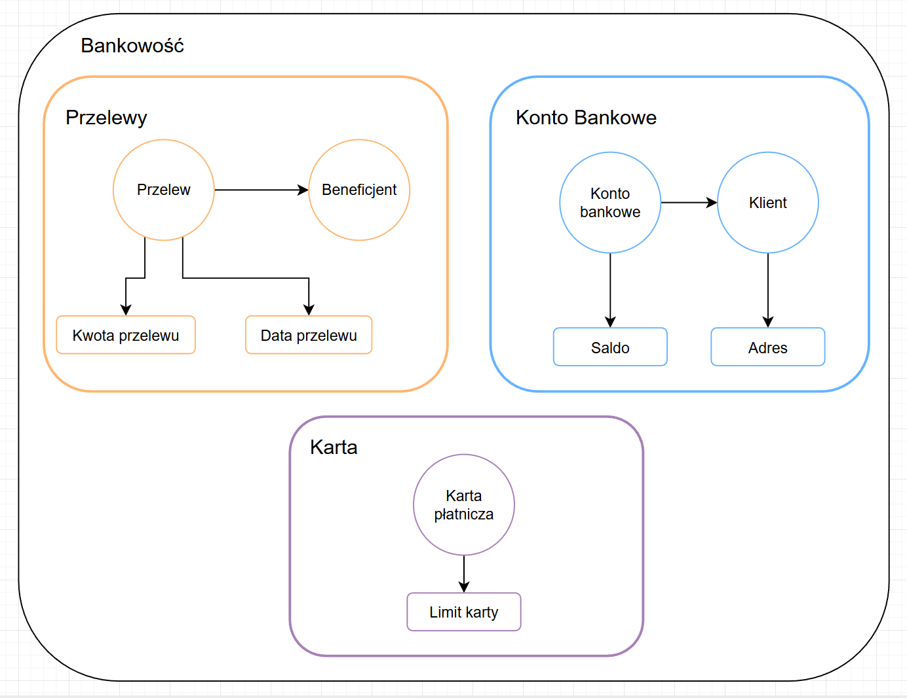

# Laboratorium 1. - Domain Driven Design

## Cel zadania

Celem zadania jest zamodelowanie fragmentu systemu bankowego zgodnie z zasadami Domain Driven Design (DDD).  
Model obejmuje pięć encji reprezentujących kluczowe elementy domeny bankowej w ramach trzech kontekstów ograniczonych:  
**Zarządzanie Kontem**, **Przelewy** oraz **Karty Płatnicze**.  

## Diagram modelu

## Konteksty Ograniczone

| Kontekst | Opis | Encje w kontekście |
|-----------|------|--------------------|
| **Zarządzanie Kontem** | Kontekst odpowiedzialny za zarządzanie kontami bankowymi i danymi klientów. Obejmuje procesy zakładania kont, weryfikację klientów, aktualizację danych osobowych oraz zarządzanie statusem kont. | KontoBankowe, Klient |
| **Przelewy** | Kontekst specjalizujący się w obsłudze operacji przelewów środków między kontami. Zarządza całym cyklem życia przelewu — od zlecenia do realizacji, w tym walidacją beneficjentów i kontrolą limitów. | Przelew, Beneficjent |
| **Karty Płatnicze** | Kontekst zajmujący się zarządzaniem kartami płatniczymi powiązanymi z kontami bankowymi. Obejmuje procesy wydawania kart, ustawiania limitów, blokowania oraz monitorowania transakcji. | KartaPlatnicza |

---

## Agregaty

| Agregat | Opis | Encje główne | Obiekty wartości |
|----------|------|---------------|------------------|
| KontoBankowe | Główny agregat zarządzający kontem | KontoBankowe, Klient | Saldo, Adres, Dokument |
| Przelew | Agregat zarządzający operacjami przelewów | Przelew, Beneficjent | KwotaPrzelewu, DataPrzelewu |
| Karta | Agregat zarządzający kartami płatniczymi | KartaPlatnicza | LimitKarty |

---

## Encje

### KontoBankowe

| Pole | Format | Opis |
|------|---------|------|
| Identyfikator | UUID | Unikalny identyfikator konta bankowego |
| Numer konta | IBAN | Międzynarodowy numer rachunku bankowego |
| Data utworzenia | Timestamp | Data i czas utworzenia konta |
| Status | Enum (AKTYWNE, ZAWIESZONE, ZAMKNIĘTE) | Aktualny status konta |
| Waluta | Enum (PLN, EUR, USD) | Główna waluta konta |
| Rodzaj konta | Enum (OSOBISTE, FIRMOWE, OSZCZĘDNOŚCIOWE) | Typ konta bankowego |

### Klient

| Pole | Format | Opis |
|------|---------|------|
| Identyfikator | UUID | Unikalny identyfikator klienta |
| PESEL | String | Numer PESEL dla osób fizycznych |
| NIP | String | Numer NIP dla firm |
| Imię i nazwisko | String | Pełne imię i nazwisko klienta |
| Email | String | Adres email klienta |
| Telefon | String | Numer telefonu klienta |
| Typ klienta | Enum (OSOBA_FIZYCZNA, FIRMA) | Rodzaj klienta |

### Przelew

| Pole | Format | Opis |
|------|---------|------|
| Identyfikator | UUID | Unikalny identyfikator przelewu |
| Status | Enum (ZLECONY, W_TRAKCIE, WYKONANY, ANULOWANY, ODRZUCONY) | Aktualny status przelewu |
| Tytuł | String | Tytuł przelewu widoczny dla odbiorcy |
| Priorytet | Enum (STANDARDOWY, EKSPRES) | Priorytet wykonania przelewu |

### Beneficjent

| Pole | Format | Opis |
|------|---------|------|
| Identyfikator | UUID | Unikalny identyfikator beneficjenta |
| Nazwa | String | Nazwa lub imię i nazwisko beneficjenta |
| Numer konta | IBAN | Numer konta bankowego beneficjenta |
| Typ | Enum (OSOBA, FIRMA) | Rodzaj beneficjenta |

### KartaPlatnicza

| Pole | Format | Opis |
|------|---------|------|
| Identyfikator | UUID | Unikalny identyfikator karty |
| Numer karty | String | Numer karty płatniczej |
| Data ważności | String | Data ważności karty w formacie MM/RR |
| CVV | String | Kod bezpieczeństwa karty |
| Status | Enum (AKTYWNA, ZABLOKOWANA, WYGASŁA) | Aktualny status karty |
| Typ | Enum (DEBETOWA, KREDYTOWA) | Rodzaj karty płatniczej |

---

## Obiekty wartości

### Saldo

| Pole | Format | Opis |
|------|---------|------|
| Kwota | Decimal | Aktualna wartość salda |
| Waluta | Enum (PLN, EUR, USD) | Waluta salda |
| Data aktualizacji | Timestamp | Data i czas ostatniej aktualizacji salda |

### KwotaPrzelewu

| Pole | Format | Opis |
|------|---------|------|
| Wartość | Decimal | Kwota do przelania |
| Waluta | Enum (PLN, EUR, USD) | Waluta przelewu |

### Adres

| Pole | Format | Opis |
|------|---------|------|
| Ulica | String | Nazwa ulicy |
| Numer domu/mieszkania | String | Numer budynku i lokalu |
| Kod pocztowy | String | Kod pocztowy |
| Miasto | String | Nazwa miejscowości |
| Kraj | String | Nazwa kraju |

### LimitKarty

| Pole | Format | Opis |
|------|---------|------|
| Limit dzienny | Decimal | Maksymalna kwota transakcji w ciągu dnia |
| Limit miesięczny | Decimal | Maksymalna kwota transakcji w ciągu miesiąca |
| Dozwolone transakcje | Enum (STACJONARNE, INTERNETOWE, WSZYSTKIE) | Rodzaje dozwolonych transakcji |

### DataPrzelewu

| Pole | Format | Opis |
|------|---------|------|
| Data zlecenia | Timestamp | Data i czas zlecenia przelewu |
| Data wykonania | Timestamp | Data i czas wykonania przelewu |
